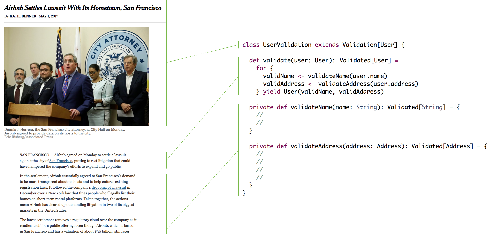

[Previous: Code Quality](./README.md)

## Readability

The ratio of time spent between reading code and writing code is of well over 10 to 1. This means that readability of code is extremely important and making it more readable can provide big gains.

### Storytelling

Then, how does readable code look like? Readable code tells a story like a book, it reads vertically and it separates complete thoughts into groups like modules, packages, classes and functions (parallel of sections, chapters, and paragraphs in books).

Code should start with a high-level abstraction (let's say a class), followed by a lower-level abstraction (the public methods) and it finishes with implementation details (the private helper functions). In parallel, a news article has a headline, a concise description, and it terminates with the details in a compelling order.



Using storytelling gives structure to our code hence it becomes easier to browse and reason about.

### Code Style

Code style also provides structure and it can be simply achieved, as long as the team agrees on something and complies with it (golden rule). As a suggestion, line sizes should not be greater than 120 characters since code reads vertically, and horizontal alignment is discouraged because it emphasizes the wrong things.

### Comments

One enemy of structure are comments, they tend to break it hence the best comment is the one we find a way not to write. However, when we can't find a way out of a comment we should make sure that it is tech related and it is our best. Non technical comments should be captured in other information systems.

### Naming

If readable code looks like a good story, then our choice of words in programming is as important as for a book writer. Hopefully, this demonstrates that good naming is not a feel-good recommendation but rather a key contributor to code quality. The recommendation for good naming is

> **Don’t be too quick to choose a name and frequently reevaluate it**

A good name should be simple and explanatory and it should be part of a consistent and unambiguous language<sup>1</sup> (ubiquitous). Also, it should reflect the level of abstraction rather than implementation<sup>2</sup>. In practice, there are some guidelines we can follow: the size of a name correlates with the size of the scope<sup>3</sup>, a class name should be a noun or a noun phrase, a method/function should be a verb or a verb phrase, a name should be searchable, and it should avoid noise words<sup>4</sup> (like variable types or prefixes).

```scala
class UserService(repo: Repository[User]) {
  def getById(uuid: UUID): Option[User] = {
    repo.findUserById(uuid)
  }
}
```

The table below details how the naming in the example above could be improved. These are only suggestions since there is no definite answer to naming.

|   | Name | Issue | Suggested Name |
|---|------|-------|----------------|
| 1 | `getById` | Inconsistent use of `get` and `find` prefix to suggest the same concept | `findById` |
| 2 | `findUserById` | `Repository` abstraction is generic hence it should not know about `User` | `findById` |
| 3 | `repo` | Abbreviations in larger scopes as classes leave room for interpretation | `repository` |
| 4 | `uuid` | It refers an implementation detail rather than a domain concept | `id` |

```scala
class UserService(repository: Repository[User]) {
  def findById(id: UUID): Option[User] = {
    repository.findById(id)
  }
}
```

[Next: Code Foundations](./foundations.md)
